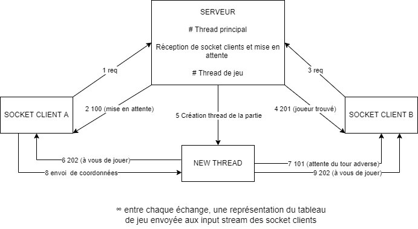

# LP APIDAE - Réseau
## Lancer le serveur
```bash
java AppServ [numero_port]
```


## Lancer un client

```bash
java ClientMorpion adresse_serveur numero_port_serveur
```


## Description du projet

### Scénarios du serveur

#### Thread principal

- Un thread principal du serveur qui écoute les requêtes des nouveaux clients 

- Lorsqu'un joueur se connecte, s'il n'y a pas d'autre joueur, il est mis en attente et son socket est stocké

- Lorsqu'un joueur se connecte et qu'il y a un autre joueur, on lance un thread avec les deux clients dont on a les sockets

  

#### Thread partie de jeu
- Pour une partie on a un thread qui stocke 1 tableau de 9 cases avec trois états possibles 0 / 1 / 2
   - 0 pour une case vide
   - 1 ou pour une case remplie par le joueur correspondant
- On envoie une grille à chaque client
- chaque tour un client donne des coordonnées qui sont mises à jour dans l'instance de la partie et les résultats sont envoyés aux deux clients
- le serveur vérifie que la case n'est pas déjà prise et qu'elle comprise dans la plage de valeurs correctes (à partir du tour 1) met à jour les valeurs puis vérifie si un joueur a gagné (à partir du tour 3) été renvoie le tableau aux clients sous la forme d'un String
- si les coordonnées ne sont pas valides, le serveur redemande des coordonnées valides au joueur en cours

### Scénarios du client

- Le client se lance et envoie une requête au serveur pour lui signifier qu'il veut jouer
- Quand deux clients sont connectés le serveur lance la partie
- le client affiche une grille vide avec le symbole qui représente les coups du joueur

- le joueur 1 (premier connecté) commence et envoie des coordonnées entre [1-3 ; 1-3]
- Le client affiche la grille du coup joué et invite le joueur à attendre le coup de son adversaire
- L'adversaire joue son coup
- Le client affiche la grille du coup joué par l'adversaire et invite le joueur à entrer des nouvelles coordonnées
- si les coordonnées ne sont pas valides, le serveur redemande des coordonnées valides au joueur en cours
- ainsi de suite jusqu'à la victoire ou le match nul
- à la réception d'un code de fin de partie, le client affiche le dernier état de la grille 

### Classe utilisées

- BufferedReader
- InputStreamReader
- getInputStream
- PrintWriter

## Codes de statut (http like)

### **1XX Informations**

- 100 : Waiting for an Opponent | attente d'un autre client
- 101 : Waiting for Opponent Turn | en attente que l'autre joueur joue
- 102 : End Of Game winning
- 103 : Play
- 104 : End of lobby
- 105: Draw

### **2XX Succès**

- 200 : OK
- 201 : Player Found | joueur trouvé
- 202 : Your Turn

### **4XX Erreurs**

- 400 : Bad request | syntaxe ou valeurs erronnées
- 406 : Not Acceptable | ressource non disponible
- 408 : Request Time-out | temps d'attente trop long côté serveur ?

### **5XX Erreur de serveur**

- 500 : Internal Server Error